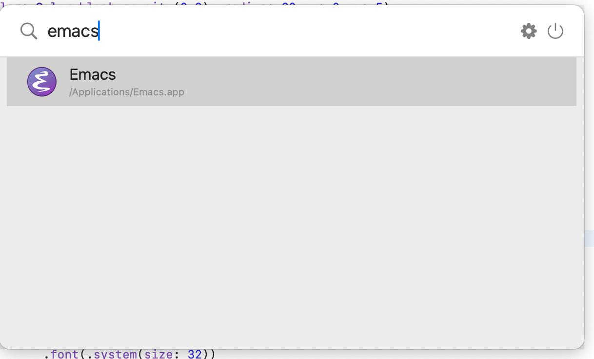
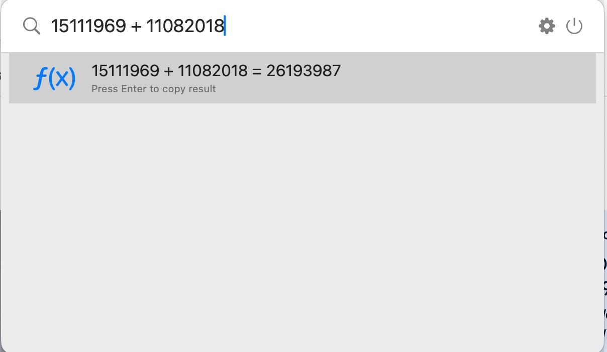
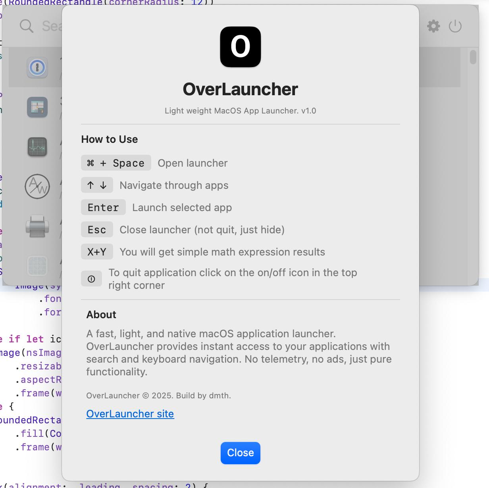

# OverLauncher

A native macOS application launcher that provides a fast, searchable interface for finding and launching installed applications.

## Features

- **Fast Search**: Real-time filtering of applications as you type
- **Global Hotkey**: Activate with Cmd+Space (customizable)
- **Native Performance**: Built with Swift and SwiftUI for optimal macOS integration
- **Application Discovery**: Automatically finds apps in:
- "/Applications"
- "/System/Applications",
- "/System/Applications/Utilities"
- "/System/Library/CoreServices"
- **Keyboard Navigation**: Use arrow keys to navigate, Enter to launch, Escape to close
- **App Icons**: Displays application icons in search results
- **Background App**: Runs silently in the background without cluttering the dock

## Requirements

- macOS 14.0 or later
- Xcode 15.0 or later

## Building

1. Open `OverLauncher.xcodeproj` in Xcode
2. Select the OverLauncher target
3. Build and run (Cmd+R)

## Usage

1. Launch OverLauncher
2. Press Cmd+Space to open the search interface
3. Type to filter applications
4. Use arrow keys to navigate or click on an app
5. Press Enter to launch the selected application
6. Press Escape to close the search interface

## Architecture

The application is structured with the following components:

- **AppLauncher**: Main controller managing search state and window visibility
- **ApplicationIndex**: Handles discovery and indexing of installed applications
- **SearchWindow**: Custom NSWindow for the floating search interface
- **SearchView**: SwiftUI view providing the search UI
- **HotKeyManager**: Manages global keyboard shortcuts using Carbon APIs
- **LauncherApp**: Model representing an application with metadata

## Configuration

The app runs as a background application (LSUIElement = true) and doesn't appear in the dock. It uses global hotkeys to provide system-wide access to the launcher functionality.

## Permissions

The app may require accessibility permissions on first run to register global hotkeys. macOS will prompt for these permissions automatically.

## Screenshots

<video src="https://github.com/noroot/overlauncher/raw/refs/heads/master/overlauncher-demo.mov" width="320" height="240" controls></video>
